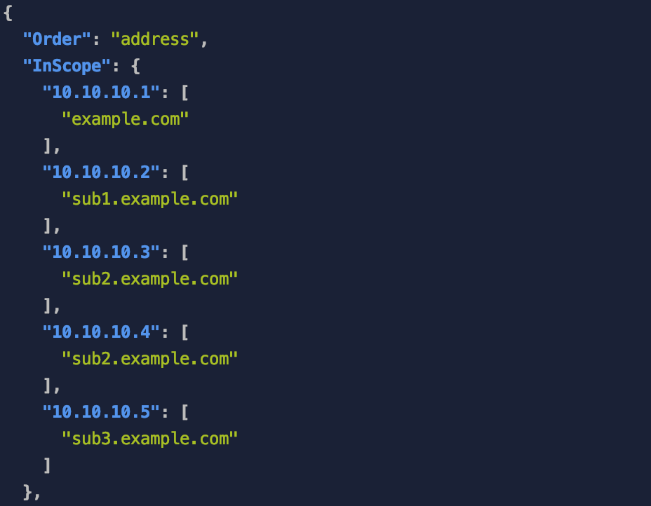
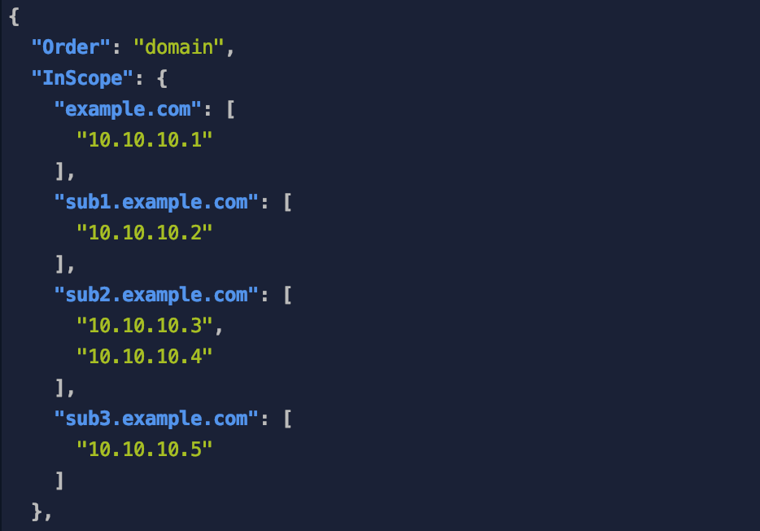

## Description:

Resolves a list of sub-domains and informs the user, which domains are in scope with the given
list of authorized addresses. Helpful if given a many addresses and sub-domain enumeration returns
many domains.

## Usage:

```
Usage:
  sub_scoper.py -s SUBDOMAIN_LIST -i IP_LIST [ --sort ORDER_TYPE ]
  sub_scoper.py --reorder OUTPUT_FILE
  sub_scoper.py (-h | --help)
  sub_scoper.py --version

Options:
  -i IP_LIST --input IP_LIST                File containing addresses to validate against
  -s SUBDOMAIN_LIST --sub SUBDOMAIN_LIST    File containing Sub-domains to check
  --reorder OUTPUT_FILE                     Reverses the sorting order of the output file
  --sort ORDER_TYPE                         Sort by 'domain' or 'address' DEFAULT is domain
  -h --help     Show this screen.
```

## Screenshots

#### Output ordered by Address 


#### Output ordered by Domain

